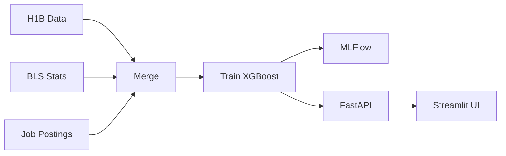

# AI Salary Prediction Pipeline

[](https://github.com/jonasneves/aipi510-project3/actions/workflows/ml-pipeline.yml)
[](https://api-salary.neevs.io)
[](https://app-salary.neevs.io)

Predict AI/ML salaries using XGBoost, FastAPI, Streamlit, and MLFlow.

**Live Demo:** [Frontend](https://app-salary.neevs.io) | [API](https://api-salary.neevs.io)

## Pipeline



## Quick Start

```bash
make install    # Install dependencies
make pipeline   # Collect data, merge, train
make api        # Start API (port 8000)
make frontend   # Start UI (port 8501)
```

## Features

- Predicts salaries based on job title, location, experience, company, skills
- Data from H1B filings, BLS statistics, job postings
- MLFlow experiment tracking
- REST API with FastAPI
- Interactive UI with Streamlit
- Docker support
- CI/CD with GitHub Actions + S3 caching

## Project Structure

```
src/                  # ML pipeline (collectors, processing, models)
api/                  # FastAPI endpoints
frontend/             # Streamlit UI
config.yaml           # Pipeline configuration
Makefile              # Convenience commands
Dockerfile            # Multi-stage builds
docker-compose.yml    # Service orchestration
```

## Documentation

- [Setup Guide](docs/SETUP.md) - Local development
- [Deployment Guide](docs/DEPLOYMENT.md) - Cloud deployment
- [AWS Setup](AWS_SETUP.md) - S3 and OIDC configuration

## API

```bash
curl -X POST http://localhost:8000/predict \
  -H "Content-Type: application/json" \
  -d '{"job_title": "ML Engineer", "location": "CA", "experience_years": 5}'
```

## License

MIT
