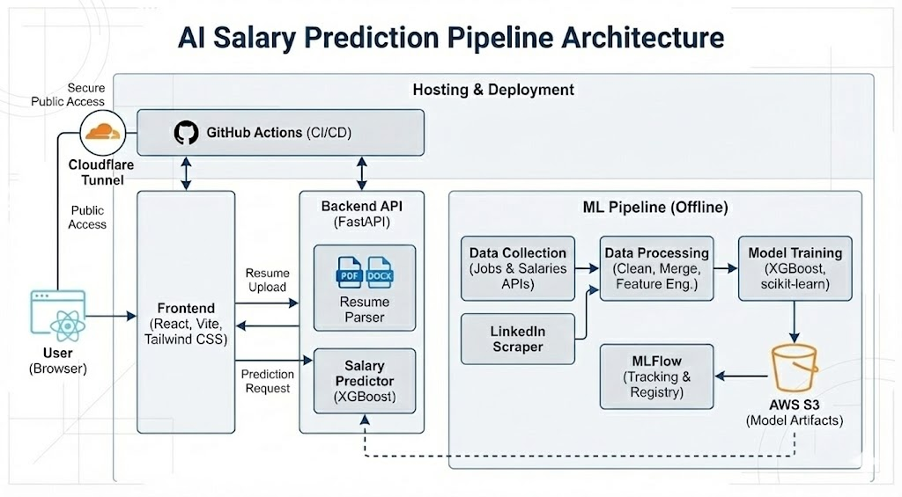

# AI Salary Prediction Pipeline

[](https://github.com/jonasneves/aipi510-project3/actions/workflows/ml-pipeline.yml)
[](https://aisalary.neevs.io/api)
[](https://aisalary.neevs.io)

**Live Demo:** [aisalary.neevs.io](https://aisalary.neevs.io) | [API Docs](https://aisalary.neevs.io/api/docs)

## Overview

Predict AI/ML salaries using machine learning. Built for Duke AIPI 510 Module Project 3.

**Problem:** Estimate salary ranges for AI/ML roles based on job title, location, experience, and skills.

**Solution:** XGBoost regression model trained on H1B visa filings and BLS wage data, deployed as a FastAPI service with a React frontend.

## Dataset

| Source | Description | Records |
|--------|-------------|---------|
| [H1B Visa Data](https://www.dol.gov/agencies/eta/foreign-labor/performance) | DOL certified visa applications with actual salaries | ~50k AI/ML jobs |
| [BLS OES](https://www.bls.gov/oes/) | Occupational wage statistics by state | Benchmark data |
| [Adzuna](https://developer.adzuna.com/) | Job postings with salary ranges | Market data |

Data hosted on AWS S3. Pipeline downloads and merges sources automatically.

## Model

**Architecture:** XGBoost Regressor

| Parameter | Value |
|-----------|-------|
| n_estimators | 200 |
| max_depth | 6 |
| learning_rate | 0.1 |

**Evaluation Metrics:**
- MAE: ~$15,000
- RMSE: ~$22,000
- R²: ~0.65

**Key Features:** Job title seniority, state location, years of experience, skills (Python, PyTorch, Kubernetes, etc.)

## Experiment Tracking

MLflow is used for experiment tracking during model training.

📊 **[View MLflow Experiment Report](docs/MLflow-Experiment-Report.pdf)**

## Architecture



## Quick Start

```bash
make install           # Install Python dependencies
make frontend-install  # Install frontend dependencies
make pipeline          # Collect data, merge, and train model
make api               # Start FastAPI server (port 8000)
make frontend          # Start React dev server (port 5173)
```

To train just the model: `make train`
To test API locally: `curl http://localhost:8000/api/health`

## Tech Stack

| Layer | Technology |
|-------|------------|
| ML | XGBoost, scikit-learn, pandas |
| API | FastAPI, Pydantic |
| Frontend | React, Vite, Tailwind CSS |
| Tracking | MLFlow |
| Cloud Storage | AWS S3 (data hosting) |
| Cloud Deployment | Cloudflare Tunnel (API + frontend) |
| CI/CD | GitHub Actions |

## Project Structure

```
src/                  # ML pipeline (collectors, processing, models)
api/                  # FastAPI endpoints
frontend-react/       # React frontend
configs/              # YAML configuration files
config.yaml           # Main pipeline configuration
Makefile              # Build commands
Dockerfile            # Container build
```

## API

```bash
# Predict salary
curl -X POST https://aisalary.neevs.io/api/predict \
  -H "Content-Type: application/json" \
  -d '{"job_title": "ML Engineer", "location": "CA", "experience_years": 5}'

# Get options
curl https://aisalary.neevs.io/api/options
```

## Documentation

- [Setup Guide](docs/SETUP.md) - Local development
- [Deployment Guide](docs/DEPLOYMENT.md) - Cloud deployment & AWS setup

## Limitations

- **Geographic bias:** H1B data skews toward CA, NY, WA where most visa sponsors operate
- **Role coverage:** Limited to AI/ML titles; doesn't cover adjacent roles well
- **Temporal lag:** H1B filings reflect offers made 6-12 months prior
- **Company representation:** Large tech companies overrepresented vs. startups

## Acknowledgments

**AI Assistants:**
- Claude Code (Anthropic) - code development and documentation
- Gemini 3 Pro Image / Nano Banana Pro (Google) - visual design

**Data Sources:**
- [U.S. Department of Labor](https://www.dol.gov/agencies/eta/foreign-labor/performance) - H1B visa data
- [Bureau of Labor Statistics](https://www.bls.gov/oes/) - wage statistics
- [Adzuna](https://developer.adzuna.com/) - job postings

## Authors

Jonas De Oliveira Neves & Omkar Sreekanth

Duke University - AIPI 510, 2025

## License

MIT
